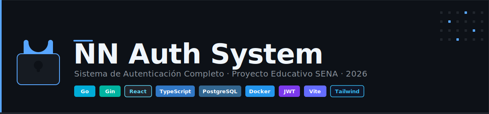

<p align="center">
  
</p>

> Proyecto educativo — SENA | Marzo 2026

Sistema de autenticación completo para una empresa genérica "NN", diseñado como ejercicio formativo. Incluye landing page pública, registro de usuarios, login, cambio de contraseña y recuperación por email.

---

## 📋 Tabla de Contenidos

- [🛠️ Stack Tecnológico](#️-stack-tecnológico)
- [✅ Prerrequisitos](#-prerrequisitos)
- [🚀 Instalación y Setup](#-instalación-y-setup)
- [▶️ Ejecución](#️-ejecución)
- [🧪 Testing](#-testing)
- [📁 Estructura del Proyecto](#-estructura-del-proyecto)
- [📏 Convenciones](#-convenciones)
- [📚 Documentación Adicional](#-documentación-adicional)
- [🎓 Propósito Educativo](#-propósito-educativo)
- [⚠️ Exención de Responsabilidades](#️-exención-de-responsabilidades)
- [📄 Licencia](#-licencia)

---

## 🛠️ Stack Tecnológico

| Capa          | Tecnología                                                   |
| ------------- | ------------------------------------------------------------ |
| Backend       | Go 1.22+, Gin, GORM, golang-migrate, JWT (golang-jwt/jwt v5) |
| Frontend      | React 18+, Vite, TypeScript, TailwindCSS 4+                  |
| Base de datos | PostgreSQL 17+ (Docker Compose o instalación local)          |
| Email (dev)   | Mailpit — captura SMTP local, UI en puerto 8025              |
| Testing       | Go testing + testify (BE), Vitest + Testing Library (FE)     |
| Linting       | golangci-lint (Go), ESLint + Prettier (TypeScript)           |

---

## ✅ Prerrequisitos

Antes de comenzar, asegúrate de tener instalado:

| Herramienta    | Versión mínima | Verificar con            |
| -------------- | -------------- | ------------------------ |
| Go             | 1.22+          | `go version`             |
| Node.js        | 20 LTS+        | `node --version`         |
| pnpm           | 9+             | `pnpm --version`         |
| Docker         | 24+            | `docker --version`       |
| Docker Compose | 2.20+          | `docker compose version` |
| Git            | 2.40+          | `git --version`          |

> ⚠️ **Importante**: Usar **pnpm** como gestor de paquetes de Node.js. Nunca usar `npm` ni `yarn`.

> 🖥️ **Usuarios de Windows** — Usar siempre **Git Bash** como terminal. Los comandos `source`, `export` y rutas con `/` no funcionan en CMD ni PowerShell.

### Instalar pnpm (si no lo tienes)

```bash
# Opción recomendada — vía corepack (incluido con Node.js 16+)
corepack enable
corepack prepare pnpm@latest --activate

# Alternativa — instalación independiente
curl -fsSL https://get.pnpm.io/install.sh | sh -
```

---

## 🚀 Instalación y Setup

### 1. Clonar el repositorio

```bash
git clone <url-del-repositorio>
cd proyecto
```

### 2. Levantar la base de datos

```bash
# Inicia PostgreSQL 17 + Mailpit (captura de emails) en contenedores Docker
docker compose up -d

# Verificar que están corriendo
docker compose ps
# Deberías ver nn_auth_db y nn_auth_mailpit con estado "healthy"
```

### 3. Configurar el Backend

```bash
cd be

# Descargar dependencias de Go
go mod download

# Copiar y configurar variables de entorno
cp .env.example .env
# Editar .env con tus valores si es necesario

# Ejecutar migraciones de base de datos
go run ./cmd/migrate/main.go up
# o usando la herramienta CLI de golang-migrate:
# migrate -path migrations/ -database "$DATABASE_URL" up
```

### 4. Configurar el Frontend

```bash
cd fe

# Instalar dependencias con pnpm (¡NUNCA con npm!)
pnpm install

# Copiar y configurar variables de entorno
cp .env.example .env
```

---

## ▶️ Ejecución

### Levantar todo el sistema (2 terminales + Docker)

```bash
# Terminal 1 — Base de datos (si no está corriendo)
docker compose up -d

# Terminal 2 — Backend (Go + Gin)
cd be
go run ./cmd/api/main.go
# → API disponible en http://localhost:8000
# → Swagger UI en http://localhost:8000/docs  (solo si ENVIRONMENT=development)

# Terminal 3 — Frontend (React + Vite)
cd fe && pnpm dev
# → Landing page en http://localhost:5173
# → App disponible en http://localhost:5173
```

> 📧 **Mailpit** — bandeja de entrada de emails de desarrollo: `http://localhost:8025`
> Aquí se capturan los emails de verificación de cuenta y recuperación de contraseña.

---

## 🧪 Testing

### Backend

```bash
cd be

# Ejecutar todos los tests
go test ./...

# Ejecutar con cobertura
go test -cover ./...
go test -coverprofile=coverage.out ./... && go tool cover -html=coverage.out

# Ejecutar un paquete específico
go test ./internal/services/... -v
```

### Frontend

```bash
cd fe

# Ejecutar todos los tests
pnpm test

# Ejecutar en modo watch
pnpm test:watch

# Ejecutar con cobertura
pnpm test:coverage
```

### Linting

```bash
# Backend
cd be && golangci-lint run ./...

# Frontend
cd fe && pnpm lint && pnpm format
```

---

## 📁 Estructura del Proyecto

```
proyecto/
├── .github/copilot-instructions.md   # Reglas y convenciones del proyecto
├── .gitignore                        # Archivos ignorados por git
├── docker-compose.yml                # PostgreSQL 17 + Mailpit para desarrollo
├── README.md                         # ← Este archivo
├── docs/                             # Documentación técnica
├── _assets/                          # Recursos estáticos
├── be/                               # Backend — Go + Gin + GORM
│   ├── cmd/
│   │   ├── api/
│   │   │   └── main.go               # Punto de entrada — arranca el servidor
│   │   └── migrate/
│   │       └── main.go               # Herramienta CLI de migraciones
│   ├── internal/
│   │   ├── config/
│   │   │   └── config.go             # Configuración desde .env (struct tipado)
│   │   ├── database/
│   │   │   └── database.go           # Conexión GORM + pool de conexiones
│   │   ├── middleware/
│   │   │   ├── auth.go               # Middleware de verificación JWT
│   │   │   ├── cors.go               # Middleware CORS
│   │   │   ├── ratelimit.go          # Rate limiting por IP
│   │   │   └── security.go           # Cabeceras de seguridad HTTP
│   │   ├── models/                   # Modelos GORM (tablas de la BD)
│   │   │   ├── user.go               # Tabla users
│   │   │   ├── password_reset_token.go
│   │   │   └── email_verification_token.go
│   │   ├── dto/                      # Data Transfer Objects (request/response)
│   │   │   └── auth.go               # RegisterRequest, LoginRequest, TokenResponse, etc.
│   │   ├── handlers/                 # Handlers HTTP (equivalente a routers)
│   │   │   ├── auth.go               # Register, Login, Refresh, ChangePassword, etc.
│   │   │   └── user.go               # GetMe
│   │   ├── services/                 # Lógica de negocio
│   │   │   └── auth_service.go
│   │   └── utils/                    # Utilidades transversales
│   │       ├── security.go           # Hashing bcrypt, generación/verificación JWT
│   │       ├── email.go              # Envío de emails (Mailpit / Resend)
│   │       └── audit_log.go          # Logging estructurado de eventos de seguridad
│   ├── migrations/                   # Scripts SQL de migraciones (golang-migrate)
│   │   ├── 000001_create_users.up.sql
│   │   ├── 000001_create_users.down.sql
│   │   ├── 000002_create_password_reset_tokens.up.sql
│   │   ├── 000002_create_password_reset_tokens.down.sql
│   │   ├── 000003_create_email_verification_tokens.up.sql
│   │   └── 000003_create_email_verification_tokens.down.sql
│   ├── go.mod                        # Módulo Go y dependencias
│   ├── go.sum                        # Checksums de dependencias
│   ├── .env.example                  # Plantilla de variables de entorno
│   └── .env                          # Variables de entorno (NO versionado)
└── fe/                               # Frontend — React + Vite + TypeScript
    ├── src/
    │   ├── api/                      # Clientes HTTP (Axios)
    │   ├── components/               # Componentes reutilizables
    │   ├── pages/                    # Páginas/vistas
    │   ├── hooks/                    # Custom hooks
    │   ├── context/                  # Context providers
    │   └── types/                    # Tipos TypeScript
    ├── package.json
    └── vite.config.ts
```

---

## 📏 Convenciones

| Aspecto              | Convención                                        |
| -------------------- | ------------------------------------------------- |
| Nomenclatura técnica | Inglés (variables, funciones, structs, endpoints) |
| Comentarios/docs     | Español (con ¿Qué? ¿Para qué? ¿Impacto?)          |
| Commits              | Conventional Commits en inglés + What/For/Impact  |
| Go                   | `gofmt` + `golangci-lint` + errores explícitos    |
| TypeScript           | strict mode + ESLint + Prettier                   |
| Gestor de módulos    | Go modules (`go mod`), pnpm (Node.js)             |
| Testing              | Código generado = código probado                  |

Para las reglas completas, ver [.github/copilot-instructions.md](.github/copilot-instructions.md).

---

## 📚 Documentación Adicional

| Archivo                                      | Contenido                                                |
| -------------------------------------------- | -------------------------------------------------------- |
| `docs/referencia-tecnica/architecture.md`    | Arquitectura general, flujos y decisiones técnicas       |
| `docs/referencia-tecnica/api-endpoints.md`   | Todos los endpoints con parámetros, respuestas y errores |
| `docs/referencia-tecnica/database-schema.md` | Esquema ER, tablas, columnas y migraciones               |
| `docs/conceptos/owasp-top-10.md`             | Implementación del OWASP Top 10 2021                     |
| `docs/conceptos/accesibilidad-aria-wcag.md`  | Estándares ARIA/WCAG 2.1 AA aplicados                    |
| `docs/conceptos/patrones-arquitectonicos.md` | Los 10 patrones arquitectónicos del proyecto             |
| `docs/setup/con-docker.md`                   | Guía paso a paso para levantar con Docker Compose        |
| `docs/setup/sin-docker.md`                   | Guía paso a paso para levantar sin Docker                |
| `.github/copilot-instructions.md`            | Reglas y convenciones del proyecto                       |

---

## 🎓 Propósito Educativo

Este proyecto está diseñado para aprender haciendo. Cada archivo, función y componente incluye comentarios pedagógicos que explican:

- **¿Qué?** — Qué hace este código
- **¿Para qué?** — Por qué existe y cuál es su propósito
- **¿Impacto?** — Qué pasa si no existiera o si se implementa mal

> "La calidad no es una opción, es una obligación."

---

## ⚠️ Exención de Responsabilidades

Este proyecto es de naturaleza exclusivamente educativa, desarrollado como ejercicio formativo en el marco del SENA.

- **No apto para producción** — El sistema no ha sido auditado ni endurecido para entornos productivos reales.
- **Credenciales de ejemplo** — Las contraseñas, claves secretas y cadenas de conexión en `.env.example` son únicamente ilustrativas.
- **Sin garantía de disponibilidad** — El proyecto puede contener bugs propios de un entorno de aprendizaje.
- **Responsabilidad del aprendiz** — Cada aprendiz es responsable de comprender el código que ejecuta en su equipo.

> Este material se provee "tal cual", sin garantías explícitas ni implícitas de ningún tipo.

---

## 📄 Licencia

Proyecto educativo — SENA. Uso exclusivamente académico.
